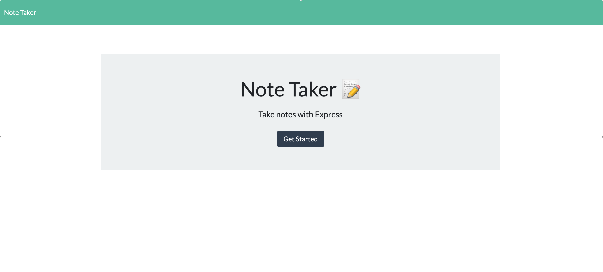
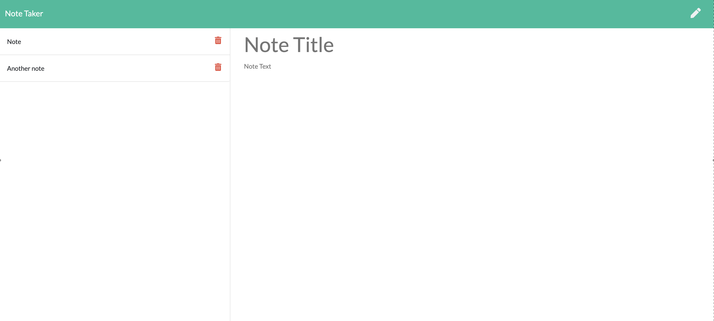
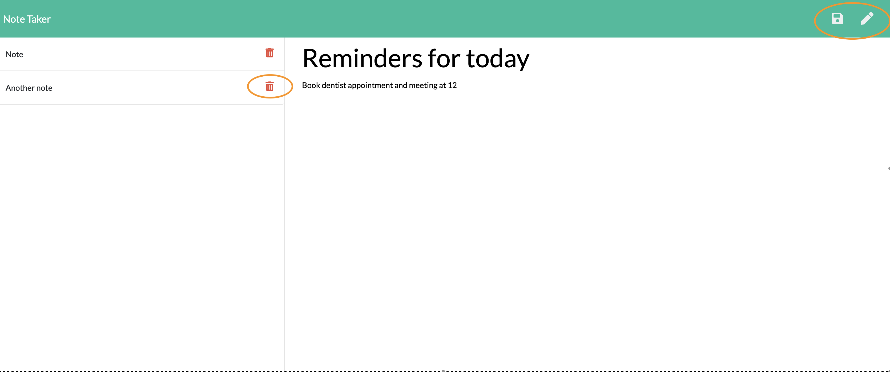

# Express Note Taker

## Description

An application, using an express back end that allows a user to add, save and delete notes.

## Table of Contents

- [Installation](#installation)
- [Usage](#usage)
- [Screenshots](#screenshots)
- [License](#license)
- [Contributing](#contributing)
- [Questions](#questions)

## Installation

To install all relevant dependencies for this project, run

    npm install

## Usage

To use this project,

    npm run start

## Screenshots

- Click on the Get Started button to begin.

- When redirected to the next page, notes can then be added, saved and deleted as required. Note content can be seen by clicking on the note titles on the left hand side.

- To write a new note, you can either click the pencil icon in the top right hand corner, or click within the text area. Once a note has been writted, it can be saved by clicking the save icon in the top right hand corner. Any note can be deleted by clicking the bin icon located next to each note in the note list.

## License

ISC License

Copyright (c) [2020], [Stephanie Morrissey]

Permission to use, copy, modify, and/or distribute this software for any
purpose with or without fee is hereby granted, provided that the above
copyright notice and this permission notice appear in all copies.

THE SOFTWARE IS PROVIDED "AS IS" AND THE AUTHOR DISCLAIMS ALL WARRANTIES
WITH REGARD TO THIS SOFTWARE INCLUDING ALL IMPLIED WARRANTIES OF
MERCHANTABILITY AND FITNESS. IN NO EVENT SHALL THE AUTHOR BE LIABLE FOR
ANY SPECIAL, DIRECT, INDIRECT, OR CONSEQUENTIAL DAMAGES OR ANY DAMAGES
WHATSOEVER RESULTING FROM LOSS OF USE, DATA OR PROFITS, WHETHER IN AN
ACTION OF CONTRACT, NEGLIGENCE OR OTHER TORTIOUS ACTION, ARISING OUT OF
OR IN CONNECTION WITH THE USE OR PERFORMANCE OF THIS SOFTWARE.

## Contributing

When contributing to this repository, please first discuss the change you wish to make via issue, email, or any other method with the owners of this repository before making a change.

1. Fork
2. Clone and setup
   git clone https://github.com/steph-morrissey/express-note-taker
3. Develop
4. Pull request

## Credits

Stephanie Morrissey - <https://github.com/steph-morrissey>
